<p align="center"></p>

<p align="center">
  
  
  
  
</p>

# Little Lemon - Capstone Project

Django project (`littlelemon`) + app (`restaurant`) that serves the Little
Lemon restaurant's static pages and exposes a Django REST Framework API for
the menu and table bookings, backed by MySQL.

## Setup

```bash
cd littlelemon
pipenv shell
pipenv install
```

Create your own local MySQL database and user (credentials differ per
machine), then update `littlelemon/settings.py` -> `DATABASES` accordingly:

```sql
CREATE DATABASE littlelemon;
CREATE USER 'littlelemon_user'@'localhost' IDENTIFIED BY 'your_password';
GRANT ALL PRIVILEGES ON littlelemon.* TO 'littlelemon_user'@'localhost';
FLUSH PRIVILEGES;
```

Then:

```bash
python manage.py makemigrations
python manage.py migrate
python manage.py createsuperuser   # needed to POST /api/menu-items/
python manage.py runserver
```

`migrate` also seeds five sample menu items automatically.

## Running the tests

```bash
python manage.py test restaurant
```

14 tests cover: the static pages loading, user registration and token
login, menu-item read/write permissions, and the booking API (auth
required, duplicate date+slot rejected, users only see their own
bookings).

## Grading criteria mapping

| Criterion | Where |
|---|---|
| Django serves static HTML content | `restaurant/templates/*.html` + `restaurant/views.py` (`index`, `about`, `menu`, `book`, `reservations`) |
| Committed to a Git repository | see "Git / GitHub" below |
| Backend connects to MySQL | `littlelemon/settings.py` -> `DATABASES` |
| Menu and table booking APIs implemented | `restaurant/api_views.py`, `restaurant/api_urls.py` -> `/api/menu-items/`, `/api/bookings/` |
| User registration and authentication | Djoser, mounted at `/api/users/` and `/api/token/login/` |
| Unit tests | `restaurant/tests.py` |
| Testable with Insomnia | plain token-authenticated JSON REST API, see `Readme.txt` for exact paths and sample bodies |

## API overview

See `Readme.txt` for the full list of paths with example request bodies.
In short:

- `POST /api/users/` and `POST /api/token/login/` for registration/auth.
- `GET /api/menu-items/` is public; writes need a staff token.
- `/api/bookings/` requires a token for every operation; each user sees
  and manages only their own bookings (staff sees all). A booking with a
  date+time that's already taken is rejected with `400`.

The public `/book/` page (plain HTML form + vanilla JS) still posts to the
older `/bookings` endpoint without requiring login, so a walk-in visitor
can reserve a table from the website itself without creating an account.
The `/api/bookings/` DRF endpoint is the authenticated, professional
interface intended for the Insomnia/API review.

## Git / GitHub

This project folder is already a Git repository with the work committed
locally. To publish it:

```bash
git remote add origin <your-empty-GitHub-repo-URL>
git branch -M main
git push -u origin main
```

Then submit that repository's URL for peer review, exactly as the
assignment describes.
